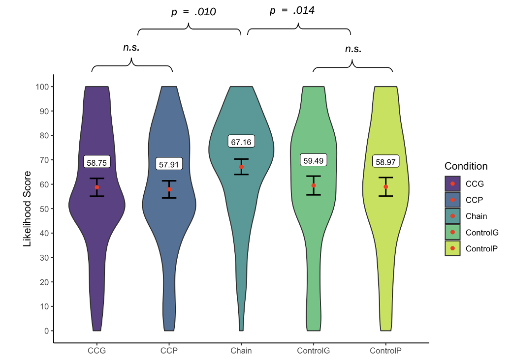

# Chain Versus Common Cause: Biased Causal Strength Judgments in Humans and Large Language Models

**Authors**: Anita Keshmirian, Moritz Willig, Babak Hemmatian, Ulrike Hahn, Kristian Kersting, Tobias Gerstenberg

Code repository for the papers
"Biased Causal Strength Judgments in Humans and Large Language Models" accepted at the Re-Align Workshop ICLR 2024 and "Chain Versus Common Cause: Biased Causal Strength Judgments in Humans and Large Language Models" accepted to CogSci 2024.

Link to paper (Re-Align@ICLR 2024): [https://openreview.net/forum?id=544P6YidFk](https://openreview.net/forum?id=544P6YidFk)



Figure 3 of the paper: Our evaluation shows increased causal effect judgment for the 'chain' setting. All plots can be found under [./media/](./media/).

**OSF Preregistration** (also containing the evaluated data): [https://osf.io/qaydt/?view_only=c9695fd480874ba9bf15cc6199dc4338](https://osf.io/qaydt/?view_only=c9695fd480874ba9bf15cc6199dc4338)

## About this repository

In addition to the figure presented in the paper, several other analysis including KL divergence and entropy metrics where conducted and included in this repository. For replicating experiments please see the 'querying data' section below. Figure 4 shown in the paper follows from the [plt_wasserstein_annealing_avg.jpg](./reasonBias/evaluation/LLM_effect/plt_wasserstein_annealing_avg.jpg) plot.

All data and resulting plots are included at the `evaluation/` directory:

```
evaluation/
|- LLM_effect/
|       Measurement of the effect (distribution distance) of switching from CC
|       to CHAIN condition in LLM data.
|- human_effect/
|       Measurement of the effect (distribution distance) of switching from CC
|       to CHAIN condition in human data.
|- LLM_control_effect/
|       Measurement of the effect (distribution distance) of switching either
|       from CC or CHAIN to CONTROL condition in LLM data.
|- human_fit / human_grid_fit/
|       Direct comparisons between human and LLM distributions. (No switching
|       between conditions).
|- data_dump/
|      Data of all LLM answers comprised in a single json file. Additional
|      meta information such as valid answer counts and a list of
|      invalid/discarded answers is included.
|- data_dump_variants/
        All LLM answers in CSV format. Data is split by individual query
        conditions.
```


## Querying data

1) Place your API keys in the respective `aleph_alpha` and `openai` files under the `keys/` directory.
2) Create datasets using `generate_causal_queries.py` and `generate_causal_queries_grid.py`.
  * Note: generating causal queries resets the `id_counters`. Make sure to run `rebuild_query_counts` before querying to keep prevent overwriting existing results.
4) Query APIs using `query_samples.py`. Configure the actual queries by commenting in or out APIs in `active_apis` and select datasets in `datasets`. Query results are stored to `queries/`.
5) Use `A0_*`, `A1_*`, `A2_*` files to summarize results in json, csv format and create plots.
